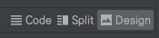

# Activity_main.xml

- 안드로이드 스튜디오에서 `Activity_main.xml`을 선택하면 통상적으로 GUI가 팝업됨

- 하지만 해당 파일은 기본적으로 code로 이루어진 xml 형식의 파일이며, 따라서 원 코드를 수정하는 것도 가능

- `Activity_main.xml`을 선택한 상태에서 우측 상단을 보면 아래와 같이 Design과 Code를 선택할 수 있음

  

- Code를 선택하면, 다음과 같은 xml 파일이 기본적으로 제공됨:

  ```xml
  <androidx.constraintlayout.widget.ConstraintLayout xmlns:android="http://schemas.android.com/apk/res/android"
      xmlns:app="http://schemas.android.com/apk/res-auto"
      xmlns:tools="http://schemas.android.com/tools"
      android:layout_width="match_parent"
      android:layout_height="match_parent"
      android:background="@color/backGround"
      tools:context=".MainActivity">
  
  </androidx.constraintlayout.widget.ConstraintLayout>
  ```

- Default인 `constraintlayout` 혹은 선택에 따라 `LinearLayout`으로 앱 화면을 꾸밀 수 있음